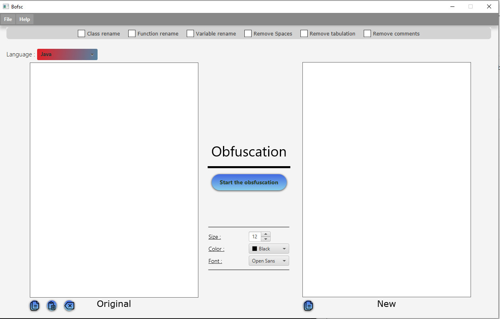
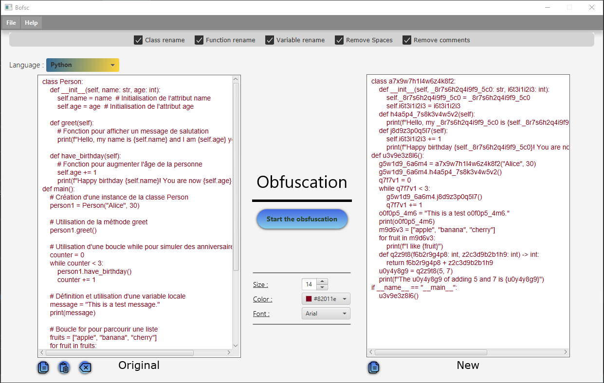

# Obfuscator

This is an Obfuscator made with Java / Javafx.
Your code becomes less readable. For Java or Python


## Demo 

#### JAVA :
Before : 
```java
import java.util.Scanner;

class SumCalculator {
    // Variable pour stocker la somme des nombres
    private int sum;

    // Constructeur
    public SumCalculator() {
        this.sum = 0;
    }

    // Méthode pour ajouter un nombre à la somme
    public void addNumber(int number) {
        if (number >= 0) {
            this.sum += number;
        }
    }

    // Méthode pour obtenir la somme actuelle
    public int getSum() {
        return this.sum;
    }
}

public class Main {
    // Méthode principale pour exécuter le programme
    public static void main(String[] args) {
        Scanner scanner = new Scanner(System.in);
        SumCalculator calculator = new SumCalculator();

        // Boucle pour demander des nombres à l'utilisateur
        for (;;) {
            System.out.print("Entrez un nombre (négatif pour arrêter) : ");
            int number = scanner.nextInt();

            // Si le nombre est négatif, on arrête la boucle
            if (number < 0) {
                break;
            }

            // On ajoute le nombre à la somme
            calculator.addNumber(number);
        }

        // Affichage de la somme totale
        System.out.println("La somme des nombres positifs est : " + calculator.getSum());
    }
}
```

After : 
Setting used -> Rename Class,Function,Variable,remove Comments,remove tabulation :

```java

import java.util.Scanner;
class t0u8i8b7v1x7_5 {
private int t2_3w3e7i8k3k4z1;
public t0u8i8b7v1x7_5() {
this.t2_3w3e7i8k3k4z1 = 0;}
public void b3u5g7w3a9t7g9(int _6x3f5v1k9a6p2t9_8) {
if (_6x3f5v1k9a6p2t9_8 >= 0) {
this.t2_3w3e7i8k3k4z1 += _6x3f5v1k9a6p2t9_8;}}
public int g6d2n9q4y5p9g3_0v1() {
return this.t2_3w3e7i8k3k4z1;}}
public class c0k7l5m7j8o5 {
public static void main(String[] i6h9a7y1k4e5b5d6j6) {
Scanner y2u5f9e5w0 = new Scanner(System.in);
t0u8i8b7v1x7_5 d4u1q9o0b5i3y9_1r4 = new t0u8i8b7v1x7_5();
for (;;) {
System.out.print("Entrez g9m0c8f4f6m7r3t3 u1t9d9i0i0 (négatif pour arrêter) : ");
int _6x3f5v1k9a6p2t9_8 = y2u5f9e5w0.nextInt();
if (_6x3f5v1k9a6p2t9_8 < 0) {
break;}
d4u1q9o0b5i3y9_1r4.b3u5g7w3a9t7g9(_6x3f5v1k9a6p2t9_8);}
System.out.println("La m1b0y9d4 des nombres positifs est : " + d4u1q9o0b5i3y9_1r4.g6d2n9q4y5p9g3_0v1());}}
```

#### Python :

Before :

```python

class Person:
    def __init__(self, name: str, age: int):
        self.name = name  # Initialisation de l'attribut name
        self.age = age  # Initialisation de l'attribut age

    def greet(self):
        # Fonction pour afficher un message de salutation
        print(f"Hello, my name is {self.name} and I am {self.age} years old.")

    def have_birthday(self):
        # Fonction pour augmenter l'âge de la personne
        self.age += 1
        print(f"Happy birthday {self.name}! You are now {self.age} years old.")
def main():
    # Création d'une instance de la classe Person
    person1 = Person("Alice", 30)

    # Utilisation de la méthode greet
    person1.greet()

    # Utilisation d'une boucle while pour simuler des anniversaires
    counter = 0
    while counter < 3:
        person1.have_birthday()
        counter += 1

    # Définition et utilisation d'une variable locale
    message = "This is a test message."
    print(message)

    # Boucle for pour parcourir une liste
    fruits = ["apple", "banana", "cherry"]
    for fruit in fruits:
        print(f"I like {fruit}")

    # Utilisation d'une fonction avec des paramètres
    def add_numbers(x: int, y: int) -> int:
        return x + y

    result = add_numbers(5, 7)
    print(f"The result of adding 5 and 7 is {result}")


if __name__ == "__main__":
    main()
```

After : Settings used -> Cls,var and func rename, removes spaces,removes comments :

```python
class a7x9w7h1l4w6z4k8f2:
    def __init__(self, _8r7s6h2q4i9f9_5c0: str, i6t3i1i2i3: int):
        self._8r7s6h2q4i9f9_5c0 = _8r7s6h2q4i9f9_5c0  
        self.i6t3i1i2i3 = i6t3i1i2i3  
    def h4a5p4_7s8k3v4w5v2(self):
        print(f"Hello, my _8r7s6h2q4i9f9_5c0 is {self._8r7s6h2q4i9f9_5c0} and I am {self.i6t3i1i2i3} years old.")
    def j8d9z3p0q5l7(self):
        self.i6t3i1i2i3 += 1
        print(f"Happy birthday {self._8r7s6h2q4i9f9_5c0}! You are now {self.i6t3i1i2i3} years old.")
def u3v9e3z8l6():
    g5w1d9_6a6m4 = a7x9w7h1l4w6z4k8f2("Alice", 30)
    g5w1d9_6a6m4.h4a5p4_7s8k3v4w5v2()
    q7f7v1 = 0
    while q7f7v1 < 3:
        g5w1d9_6a6m4.j8d9z3p0q5l7()
        q7f7v1 += 1
    o0f0p5_4m6 = "This is a test o0f0p5_4m6."
    print(o0f0p5_4m6)
    m9d6v3 = ["apple", "banana", "cherry"]
    for fruit in m9d6v3:
        print(f"I like {fruit}")
    def q2z9t8(f6b2r9g4p8: int, z2c3d9b2b1h9: int) -> int:
        return f6b2r9g4p8 + z2c3d9b2b1h9
    u0y4y8g9 = q2z9t8(5, 7)
    print(f"The u0y4y8g9 of adding 5 and 7 is {u0y4y8g9}")
if __name__ == "__main__":
    u3v9e3z8l6()
```


## Screenshots



Exemple UI :



##

This project has been making by boubou. If you want to give me any idea to enhance my project or improve my skill :

Discord : .bou_bou_

Thanks !
